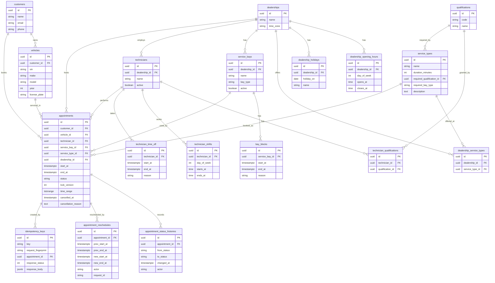

# Entity Relationship Diagram

```mermaid
erDiagram
  dealerships ||--o{ dealership_opening_hours : has
  dealerships ||--o{ dealership_holidays : has
  dealerships ||--o{ dealership_service_types : offers
  service_types ||--o{ dealership_service_types : offered_at
  dealerships ||--o{ service_bays : has
  dealerships ||--o{ technicians : employs
  dealerships ||--o{ appointments : hosts
  service_bays ||--o{ bay_blocks : has
  service_bays ||--o{ appointments : used_by
  technicians ||--o{ technician_qualifications : has
  qualifications ||--o{ technician_qualifications : granted_by
  qualifications ||--o{ service_types : required_by
  technicians ||--o{ technician_shifts : works
  technicians ||--o{ technician_time_off : takes
  technicians ||--o{ appointments : performs
  service_types ||--o{ appointments : booked_as
  customers ||--o{ vehicles : owns
  customers ||--o{ appointments : books
  vehicles ||--o{ appointments : serviced_in
  appointments ||--o{ appointment_status_histories : records
  appointments ||--o{ appointment_reschedules : rescheduled_by
  appointments ||--o{ idempotency_keys : created_by

  dealerships {
    uuid id PK
    string name
    string time_zone
  }
  dealership_opening_hours {
    uuid id PK
    uuid dealership_id FK
    int day_of_week
    time opens_at
    time closes_at
  }
  dealership_holidays {
    uuid id PK
    uuid dealership_id FK
    date holiday_on
    string name
  }
  service_bays {
    uuid id PK
    uuid dealership_id FK
    string name
    string bay_type
    boolean active
  }
  qualifications {
    uuid id PK
    string code
    string name
  }
  technicians {
    uuid id PK
    uuid dealership_id FK
    string name
    boolean active
  }
  technician_qualifications {
    uuid id PK
    uuid technician_id FK
    uuid qualification_id FK
  }
  technician_shifts {
    uuid id PK
    uuid technician_id FK
    int day_of_week
    time starts_at
    time ends_at
  }
  technician_time_off {
    uuid id PK
    uuid technician_id FK
    timestamptz start_at
    timestamptz end_at
    string reason
  }
  bay_blocks {
    uuid id PK
    uuid service_bay_id FK
    timestamptz start_at
    timestamptz end_at
    string reason
  }
  service_types {
    uuid id PK
    string name
    int duration_minutes
    uuid required_qualification_id FK
    string required_bay_type
    text description
  }
  dealership_service_types {
    uuid id PK
    uuid dealership_id FK
    uuid service_type_id FK
  }
  customers {
    uuid id PK
    string name
    string email
    string phone
  }
  vehicles {
    uuid id PK
    uuid customer_id FK
    string vin
    string make
    string model
    int year
    string license_plate
  }
  appointments {
    uuid id PK
    uuid customer_id FK
    uuid vehicle_id FK
    uuid technician_id FK
    uuid service_bay_id FK
    uuid service_type_id FK
    uuid dealership_id FK
    timestamptz start_at
    timestamptz end_at
    string status
    int lock_version
    tstzrange time_range
    timestamptz cancelled_at
    text cancellation_reason
  }
  appointment_status_histories {
    uuid id PK
    uuid appointment_id FK
    string from_status
    string to_status
    timestamptz changed_at
    string actor
  }
  appointment_reschedules {
    uuid id PK
    uuid appointment_id FK
    timestamptz prev_start_at
    timestamptz prev_end_at
    timestamptz new_start_at
    timestamptz new_end_at
    string actor
    string request_id
  }
  idempotency_keys {
    uuid id PK
    string key
    string request_fingerprint
    uuid appointment_id FK
    int response_status
    jsonb response_body
  }
```
